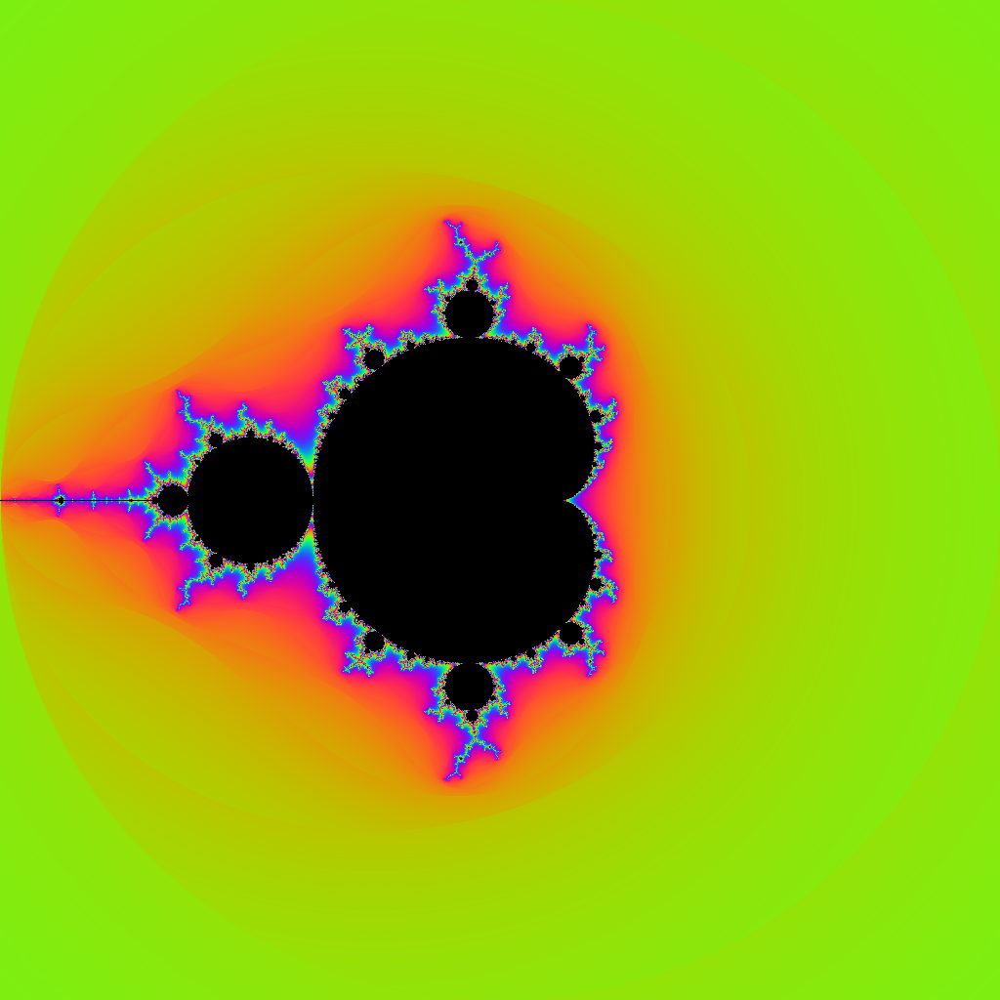
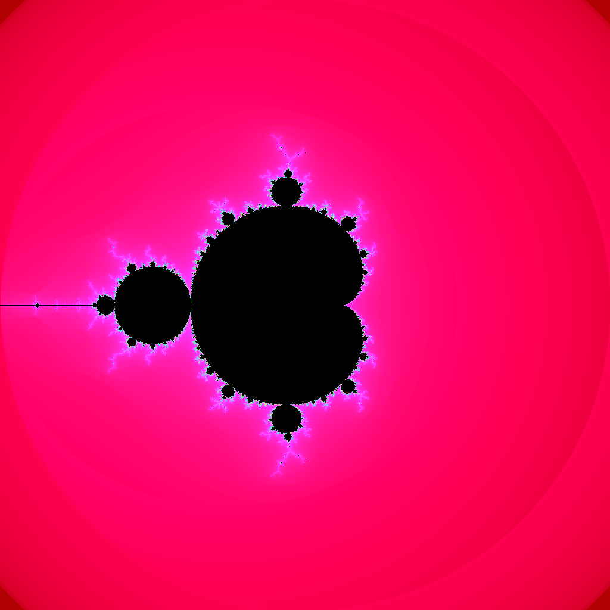

# Exercise 3.5

Implement a full-color Mandelbrot set using the function `image.NewRGBA` and the type `color.RGBA` or `color.YCbCr`.

## Usage

This exercise produces a generated image in a `images/` directory inside the exercise folder.
To generate the image, either run the program from this directory:

```
cd ch3/excercise/3.5
go run .
```

Or run it from the repository root:

```
go run ./ch3/excercise/3.5/main.go
```

The program writes output files relative to the current working directory. For example,
running it in this folder will create images such as
`ch3/excercise/3.5/images/resRGB.png` and `ch3/excercise/3.5/images/resYCbCr.png`.
Adjust the path or working directory as needed.

## Results

The images generated by this exercise are shown below. They will appear on
GitHub or a local renderer after you run the program and commit the generated
files into the repository.

### RGB



### YCbCr

